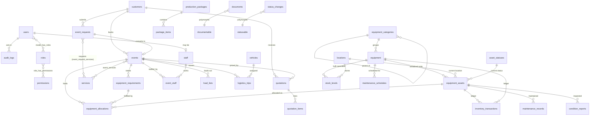

# Nebo Stage — Database Design

Conventions: `bigint` auto-increment primary keys; foreign keys with explicit `ON DELETE` behaviour (`restrict` for history, `cascade` only for owned child rows, `set null` for optional links); `timestamps` everywhere; `softDeletes` on master data; money as **integer kobo** (`*_amount` / `*_kobo` bigint); UTC timestamps. Tables marked **(P1)** exist after Phase 1; the rest are the target design for later phases and may be refined when built (changes are recorded here).

## Entity relationship overview

## Foundation

| Table | Key columns | Notes |
| --- | --- | --- |
| `users` **(P1)** | name, email (unique), phone, job_title, password, is_active, last_login_at, last_login_ip, soft deletes | Login accounts only (see D5). |
| `roles`, `permissions`, `model_has_roles`, `model_has_permissions`, `role_has_permissions` **(P1)** | spatie schema + `roles.description`, `roles.is_system` | Permission names `module.action`. |
| `settings` **(P1)** | key (unique), value (json text), updated_by → users | Cached; typed by the settings schema in code. |
| `audit_logs` **(P1)** | user_id → users (set null), user_name, event, auditable_type, auditable_id, description, old_values json, new_values json, ip_address, user_agent, url, created_at | Append-only: the model refuses update/delete; no edit routes. Indexed on (auditable_type, auditable_id), user_id, event, created_at. |
| `notifications` **(P1)** | Laravel schema (uuid, type, notifiable morph, data json, read_at) | In-app channel. |
| `sequences` **(P1)** | key, period, next_value; unique(key, period) | Row-locked by `ReferenceGenerator`. |
| `lookups` | group, key, label, sort_order, is_active, meta json; unique(group, key) | Event types, budget ranges, condition grades, maintenance types, staff roles, vehicle types. |
| `status_changes` | statusable morph, from_status, to_status, user_id, note, created_at | Timeline for requests, events, quotations, load lists. |
| `documents` | documentable morph, category (lookup key), original_name, disk, path, mime, size, checksum sha256, uploaded_by, visibility (`internal`/`customer`), soft deletes | Private disk only. |

## Inventory

| Table | Key columns | Notes |
| --- | --- | --- |
| `equipment_categories` | parent_id (self), name, slug (unique), description, icon, sort_order, is_active, soft deletes | Subcategories via `parent_id`. |
| `locations` | parent_id (self), name, code (unique), type (warehouse/site/transit/maintenance/other), address, is_active, soft deletes | Future `branch_id`. |
| `asset_statuses` | code (unique), label, color, is_allocatable, is_in_service, is_terminal, is_system, sort_order | Seeded: available, reserved, allocated, checked_out, deployed, in_transit, on_site, under_inspection, maintenance_required, under_maintenance, damaged, lost, retired, unavailable. |
| `equipment` | category_id, name, sku (unique), manufacturer, model, tracking_mode (`serialized`/`bulk`), unit, description, image_path, replacement_value_kobo, low_stock_threshold, is_active, soft deletes | Catalogue item. |
| `equipment_assets` | equipment_id, asset_tag (unique), serial_number (unique per equipment, nullable), barcode (unique, nullable), qr_token (unique, ULID), status_id, condition (lookup key), location_id, purchase_date, purchase_cost_kobo, current_value_kobo, supplier, warranty_expires_on, last_inspected_at, next_maintenance_due_on, usage_count, notes, soft deletes | Physical unit; `qr_token` drives the future scan URL `/app/scan/{qr_token}`. |
| `stock_levels` | equipment_id, location_id, bucket (`available`/`quarantine`), quantity (unsigned); unique(equipment_id, location_id, bucket) | Bulk items. Quantity can never go negative (unsigned + service check). |
| `inventory_transactions` | type (purchased/added/reserved/allocated/checked_out/deployed/transferred/returned/damaged/lost/repaired/retired/adjusted), equipment_id, asset_id (nullable), quantity, from_location_id, to_location_id, from_status_id, to_status_id, event_id (nullable), reference_type/id, user_id, note, occurred_at | Immutable ledger. |

## Requests, customers, events

| Table | Key columns | Notes |
| --- | --- | --- |
| `customers` | name, company, email (normalised, indexed), phone (E.164, indexed), address, notes, needs_review, soft deletes | De-duplication: see ARCHITECTURE risks. |
| `services` | name, slug (unique), description, icon, sort_order, is_active, is_public | Public form shows `is_public && is_active`. |
| `event_requests` | reference (unique), public_token (unique), customer_id, event_name, event_type (lookup), event_type_other, event_date, venue, venue_meta json, phone, email, contact_person, company, duration_days, starts_at, ends_at, setup_at, has_existing_design, budget_range (lookup), requirements, additional_info, services_other, status, assigned_to → users, submitted_ip, converted_event_id | Status enum + `status_changes`. |
| `event_request_services` | event_request_id, service_id | Pivot. |
| `events` | reference (unique), event_request_id, customer_id, name, event_type, venue, venue_meta, starts_at, ends_at, setup_starts_at, breakdown_ends_at, status, project_manager_id, production_manager_id (→ staff), budget_kobo, notes, soft deletes | Hold window = setup_starts_at → breakdown_ends_at (+ buffer). |
| `event_services` | event_id, service_id, notes | |
| `staff` | user_id (nullable, unique), name, phone, email, role (lookup), is_active, soft deletes | |
| `event_staff` | event_id, staff_id, role, starts_at, ends_at; unique(event_id, staff_id) | Staff double-booking check uses the same overlap logic. |

## Availability, allocation, load-out, returns

| Table | Key columns | Notes |
| --- | --- | --- |
| `equipment_requirements` | event_id, equipment_id (or category_id for generic needs), quantity, notes; unique(event_id, equipment_id) | What the event needs. |
| `equipment_allocations` | event_id, requirement_id, equipment_id, asset_id (nullable for bulk), quantity, hold_starts_at, hold_ends_at, state (`reserved`/`allocated`/`checked_out`/`returned`/`released`), allocated_by, released_at | Overlap index on (equipment_id, hold_starts_at, hold_ends_at), (asset_id, hold_starts_at, hold_ends_at). |
| `load_lists` | event_id, reference, status (pending/picked/loaded/checked/dispatched), prepared_by | |
| `load_list_items` | load_list_id, allocation_id, case_asset_id, status, checked_by, checked_at, note | |
| `return_checks` | event_id, checked_by, completed_at | |
| `return_check_items` | return_check_id, allocation_id, outcome (returned/missing/damaged/needs_inspection/needs_maintenance), quantity, note | Missing/damaged outcomes create ledger rows and notifications. |

## Maintenance & condition

| Table | Key columns |
| --- | --- |
| `maintenance_records` | asset_id (or equipment_id for bulk), type (lookup), issue, description, reported_at, reported_by, technician_id → staff, starts_at, completed_at, cost_kobo, parts_used, next_due_on, status |
| `maintenance_schedules` | equipment_id or asset_id, type, interval_days, next_due_on, last_done_on, is_active |
| `condition_reports` | asset_id, from_condition, to_condition, note, reported_by, source (return/inspection/manual) — photos via `documents` |

## Logistics, commercial

| Table | Key columns |
| --- | --- |
| `vehicles` | name, registration (unique), type (lookup), capacity, default_driver_id → staff, status, location_id, soft deletes |
| `logistics_trips` | event_id, vehicle_id, driver_id, direction (outbound/return), pickup_location, delivery_location, scheduled_at, loading_status, dispatch_status, delivery_status, notes |
| `logistics_trip_crew` | trip_id, staff_id |
| `quotations` | reference, customer_id, event_id / event_request_id, status, issued_on, valid_until, subtotal_kobo, discount_kobo, tax_kobo, total_kobo, notes, terms, prepared_by, sent_at, viewed_at, accepted_at |
| `quotation_items` | quotation_id, section (services/equipment/labour/transport/logistics/other), description, equipment_id / service_id (nullable), quantity, days, unit_price_kobo, line_total_kobo, sort_order |
| `production_packages`, `package_items` | name, description, is_active / package_id, item type, references, quantity, unit_price_kobo |

## Integrity rules enforced in the database

- Unique: user email, asset tag, barcode, qr_token, (equipment, serial number), sku, references, (equipment, location, bucket) stock bucket, (key, period) sequences.
- Unsigned quantities on stock and allocations (no negative inventory).
- Foreign keys `restrict` on anything with history (assets, events, customers) so history cannot be orphaned; archiving uses soft deletes.
- Overlap (double allocation) is enforced in the allocation transaction (D9) because MySQL lacks exclusion constraints.
